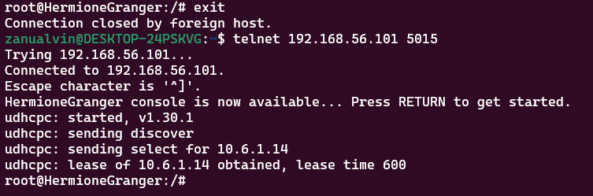
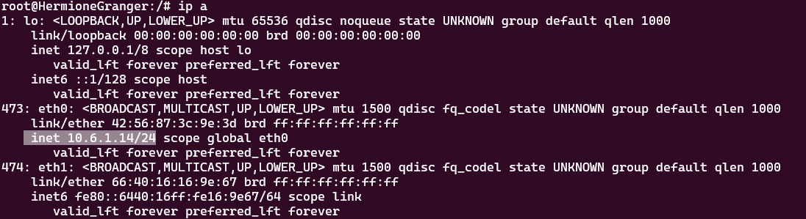
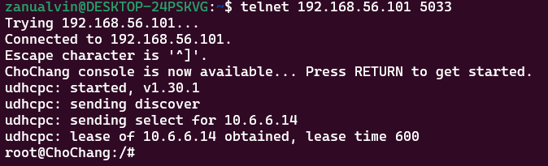
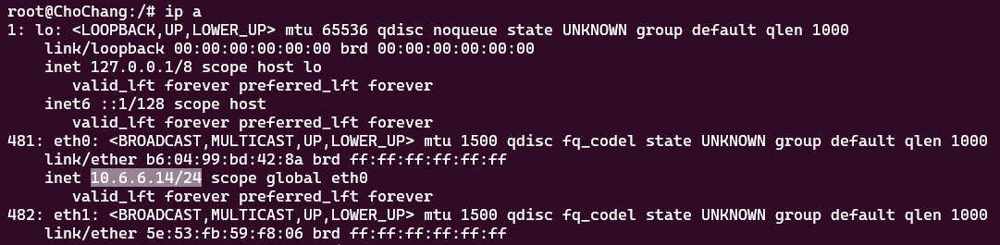
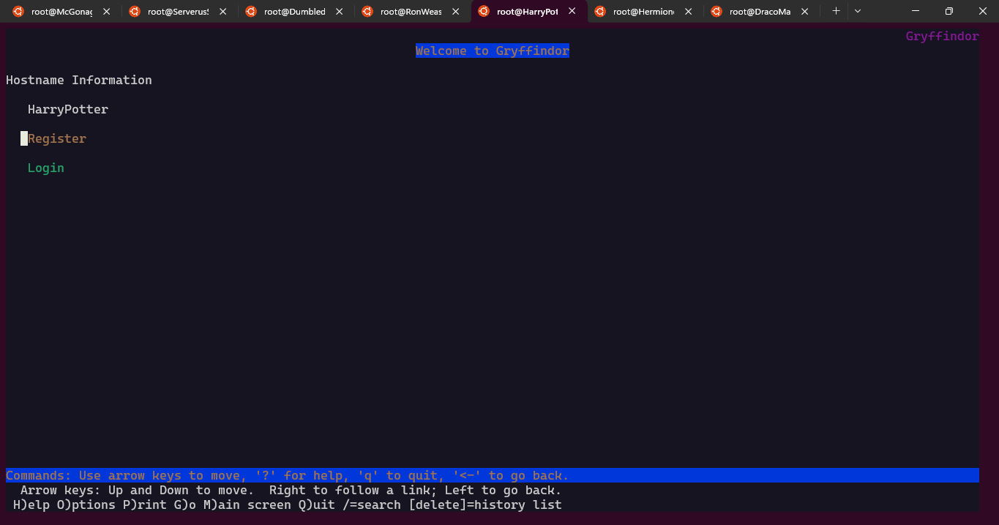
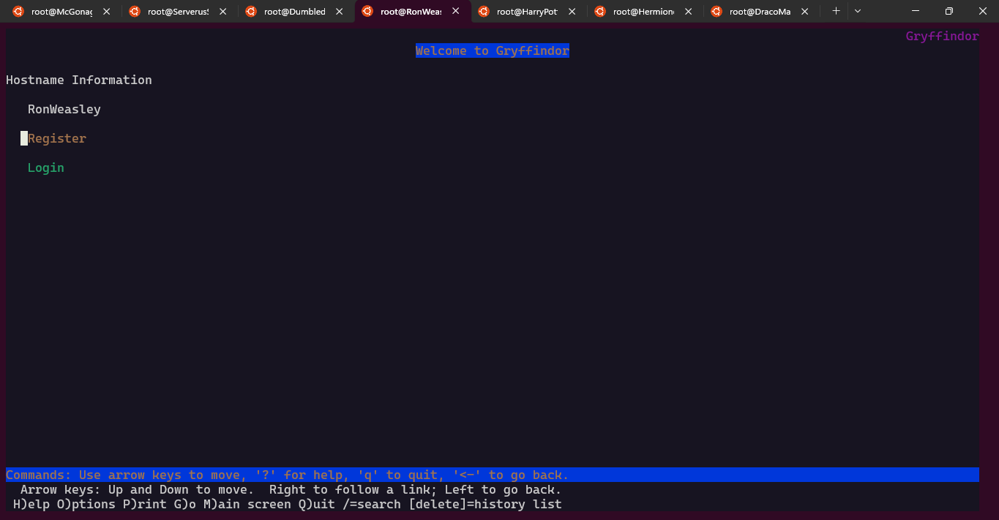
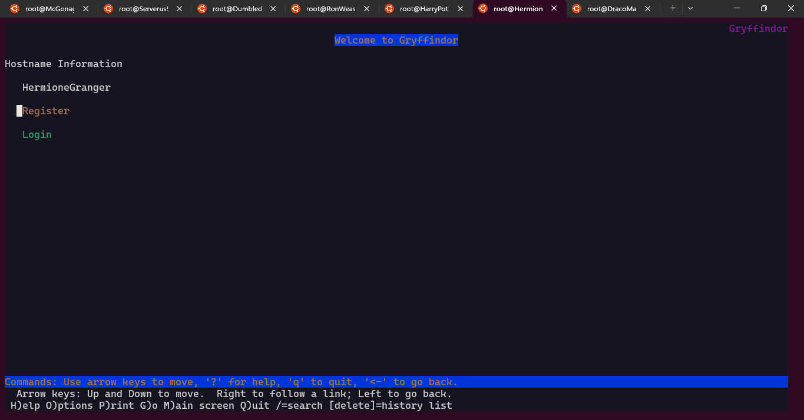

[](https://classroom.github.com/a/1zoHyFGp)
| Name | NRP | Kelas |
| -------------------- | ---------- | --------------------- |
| Nuril Qolbi Zam Zami | 5025221296 | Jaringan Komputer (A) |
| Alvin Zanua Putra | 5025231064 | Jaringan Komputer (A) |

## Put your topology config image here!


<br>

> Template testing report: https://docs.google.com/document/d/17T0fsnh_4zZTrG-lELDJ88intrc9mkwCzZ_s-23JLCc/edit?usp=sharing

## Put your testing report here!

> The report is sent in PDF format, uploaded to Drive, and set to public view.

https://drive.google.com/drive/folders/10ARgZs6oTQcR-GPuFB6xQk4eRxUrcdqu?usp=drive_link

## Soal 0

> Pada perlombaan akhir tahun kali ini, semua worker dan client ikut serta di dalamnya sebagai perwakilan dari masing-masing asrama. Persiapan yang dilakukan untuk perlombaan ini adalah dengan setup semua network configuration yang sesuai dengan tabel peran diatas. Khusus untuk client menggunakan konfigurasi dari DHCP Server.

> _For the end-of-year competition, all the workers and clients participate, representing their respective houses. The preparation includes setting up the network configuration as per the table above, with clients using DHCP Server configuration_

**Answer**

- Dumbledore:

```bash

auto eth0
iface eth0 inet dhcp
up iptables -t nat -A POSTROUTING -o eth0 -j MASQUERADE -s 10.6.0.0/16

auto eth1
iface eth1 inet static
    address 10.6.1.0
    netmask 255.255.255.0

auto eth2
iface eth2 inet static
    address 10.6.2.0
    netmask 255.255.255.0

auto eth3
iface eth3 inet static
    address 10.6.3.0
    netmask 255.255.255.0

auto eth4
iface eth4 inet static
    address 10.6.4.0
    netmask 255.255.255.0

auto eth5
iface eth5 inet static
    address 10.6.5.0
    netmask 255.255.255.0

auto eth6
iface eth6 inet static
    address 10.6.6.0
    netmask 255.255.255.0

```

- SeverusSnape:

```bash
auto eth0
iface eth0 inet static
	address 10.6.3.1
	netmask 255.255.255.0
	gateway 10.6.3.0

up echo nameserver 192.168.122.1 > /etc/resolv.conf
```

- McGonagall:

```bash
auto eth0
iface eth0 inet static
	address 10.6.3.2
	netmask 255.255.255.0
	gateway 10.6.3.0

up echo nameserver 192.168.122.1 > /etc/resolv.conf
```

- Hagrid:

```bash
auto eth0
iface eth0 inet static
	address 10.6.4.1
	netmask 255.255.255.0
	gateway 10.6.4.0

up echo nameserver 192.168.122.1 > /etc/resolv.conf
```

- Voldemort:

```bash
auto eth0
iface eth0 inet static
	address 10.6.4.2
	netmask 255.255.255.0
	gateway 10.6.4.0

up echo nameserver 192.168.122.1 > /etc/resolv.conf
```

- Dementor:

```bash
auto eth0
iface eth0 inet static
	address 10.6.4.3
	netmask 255.255.255.0
	gateway 10.6.4.0

up echo nameserver 192.168.122.1 > /etc/resolv.conf
```

- HarryPotter:

```bash
auto eth0
iface eth0 inet static
	address 10.6.1.1
	netmask 255.255.255.0
	gateway 10.6.1.0

up echo nameserver 192.168.122.1 > /etc/resolv.conf
hwaddress ether 16:f4:03:ef:37:a4
```

- RonWeasley:

```bash
auto eth0
iface eth0 inet static
	address 10.6.1.2
	netmask 255.255.255.0
	gateway 10.6.1.0

up echo nameserver 192.168.122.1 > /etc/resolv.conf
hwaddress ether 02:68:ce:3a:21:1d
```

- HermioneGranger:

```bash
auto eth0
iface eth0 inet static
	address 10.6.1.3
	netmask 255.255.255.0
	gateway 10.6.1.0

up echo nameserver 192.168.122.1 > /etc/resolv.conf
hwaddress ether 42:56:87:3c:9e:3d
```

- LunaLovegood:

```bash
auto eth0
iface eth0 inet static
	address 10.6.6.3
	netmask 255.255.255.0
	gateway 10.6.6.0
up echo nameserver 192.168.122.1 > /etc/resolv.conf
hwaddress ether 0e:c5:2d:3a:88:1a
```

- FiliusFlitwick:

```bash
auto eth0
iface eth0 inet static
	address 10.6.6.2
	netmask 255.255.255.0
	gateway 10.6.6.0

up echo nameserver 192.168.122.1 > /etc/resolv.conf
hwaddress ether 2e:78:b3:b0:67:d3
```

- ChoChang:

```bash
  auto eth0
iface eth0 inet static
	address 10.6.6.1
	netmask 255.255.255.0
	gateway 10.6.6.0

up echo nameserver 192.168.122.1 > /etc/resolv.conf
hwaddress ether b6:04:99:bd:42:8a
```

- DracoMalfoy:

```bash
auto eth0
iface eth0 inet dhcp
```

- AstoriaGreengrass:

```bash
auto eth0
iface eth0 inet dhcp
```

- SusanBones:

```bash
auto eth0
iface eth0 inet dhcp
```

- HannahAbbott:

```bash
auto eth0
iface eth0 inet dhcp
```

### Sebelum Memulai

setiap node, kita inisiasi pada `.bashrc` menggunakan `nano`

- DNS Server
  ```sh
  echo 'nameserver 192.168.122.1' > /etc/resolv.conf
  apt-get update
  apt-get install bind9 -y
  ```
- DHCP Server
  ```sh
  echo 'nameserver 10.6.1.2' > /etc/resolv.conf   # Pastikan DNS Server sudah berjalan
  apt-get update
  apt install isc-dhcp-server -y
  ```
- DHCP Relay
  ```sh
  apt-get update
  apt install isc-dhcp-relay -y
  ```
- Database Server

  ```sh
  echo 'nameserver 10.6.1.2' > /etc/resolv.conf
  apt-get update
  apt-get install mariadb-server -y
  service mysql start

  Lalu jangan lupa untuk mengganti [bind-address] pada file /etc/mysql/mariadb.conf.d/50-server.cnf menjadi 0.0.0.0 dan jangan lupa untuk melakukan restart mysql kembali
  ```

- Load Balancer

  ```sh
  echo 'nameserver 10.6.1.2' > /etc/resolv.conf
  apt-get update
  apt-get install apache2-utils -y
  apt-get install nginx -y
  apt-get install lynx -y

  service nginx start
  ```

- Worker PHP

  ```sh
  echo 'nameserver 10.6.1.2' > /etc/resolv.conf
  apt-get update
  apt-get install nginx -y
  apt-get install wget -y
  apt-get install unzip -y
  apt-get install lynx -y
  apt-get install htop -y
  apt-get install apache2-utils -y
  apt-get install php7.4-fpm php7.4-common php7.4-mysql php7.4-gmp php7.4-curl php7.4-intl php7.4-mbstring php7.4-xmlrpc php7.4-gd php7.4-xml php7.4-cli php7.4-zip -y

  service nginx start
  service php7.4-fpm start
  ```

- Worker Laravel

  ```sh
  echo 'nameserver 10.6.1.2' > /etc/resolv.conf
  apt-get update
  apt-get install lynx -y
  apt-get install mariadb-client -y
  # Test connection from worker to database
  # mariadb --host=10.6.2.1 --port=3306   --user=kelompoka05 --password=passworda05 dbkelompoka05 -e "SHOW DATABASES;"
  apt-get install -y lsb-release ca-certificates apt-transport-https software-properties-common gnupg2
  curl -sSLo /usr/share/keyrings/deb.sury.org-php.gpg https://packages.sury.org/php/apt.gpg
  sh -c 'echo "deb [signed-by=/usr/share/keyrings/deb.sury.org-php.gpg] https://packages.sury.org/php/ $(lsb_release -sc) main" > /etc/apt/sources.list.d/php.list'
  apt-get update
  apt-get install php8.0-mbstring php8.0-xml php8.0-cli   php8.0-common php8.0-intl php8.0-opcache php8.0-readline php8.0-mysql php8.0-fpm php8.0-curl unzip wget -y
  apt-get install nginx -y

  service nginx start
  service php8.0-fpm start
  ```

- Client
  ```sh
  apt update
  apt install lynx -y
  apt install htop -y
  apt install apache2-utils -y
  apt-get install jq -y
  ```

## Soal 1

> Melakukan registrasi subdomain untuk PHP worker bernama gryffindor.hogwarts.yyy.com yang mengarah ke alamat IP load balancer Voldemort dan untuk laravel worker bernama ravenclaw.hogwarts.yyy.com yang mengarah ke alamat IP load balancer Dementor. Seluruh domain ini berkumpul dalam suatu ruang atau folder bernama hogwarts

> _Registering subdomains for the PHP workers named gryffindor.hogwarts.yyy.com, pointing to the IP Voldemort load balancer, and for the Laravel workers named ravenclaw.hogwarts.yyy.com, pointing to the IP Dementor load balancer. All domains are gathered in a folder named "hogwarts."_

**Answer:**

- Screenshot

  

- Configuration

`Buat zona dulu`

**Di McGonagall**

```bash
echo '
zone "hogwarts.a05.com" {
        type master;
        file "/etc/bind/hogwarts/hogwarts.a05.com";
};' >/etc/bind/named.conf.local

cp /etc/bind/db.local /etc/bind/hogwarts/hogwarts.a05.com

echo '
$TTL    604800
@       IN      SOA     hogwarts.a05.com. root.hogwarts.a05.com. (
                        2023110101    ; Serial
                        604800        ; Refresh
                        86400         ; Retry
                        2419200       ; Expire
                        604800 )      ; Negative Cache TTL
;
@               IN      NS      hogwarts.a05.com.
@               IN      A       10.6.3.2 ; MasterDNS
www             IN      CNAME   hogwarts.a05.com.
gryffindor      IN      A       10.6.4.2 ; IP Voldemort
ravenclaw       IN      A       10.6.4.3 ; IP Dementor
www.gryffindor  IN      CNAME   gryffindor.hogwarts.a05.com.
' >/etc/bind/hogwarts/hogwarts.a05.com
```

`Lalu untuk perintah dibawah ini digunakan untuk mengkonfigurasi BIND (server DNS) dengan pengaturan sebagai berikut: Direktori cache: Menyimpan data DNS di /var/cache/bind.
Forwarder: Mengarahkan query DNS yang tidak diketahui ke server lain (IP 192.168.122.1). Query terbuka: Mengizinkan semua klien untuk melakukan query, NXDOMAIN: Mengatur tanggapan untuk domain yang tidak ada, Dukungan IPv6: Menerima koneksi dari klien IPv6.`

**Di McGonagall**

```bash
echo 'options {
      directory "/var/cache/bind";

      forwarders {
        192.168.122.1;
      };

      // dnssec-validation auto;
      allow-query{any;};
      auth-nxdomain no; 
      listen-on-v6 { any; };
}; ' >/etc/bind/named.conf.options
```

`Jangan lupa untuk selalu restart server yang akan diakses client menggunakan "service named restart", untuk bisa ping perlu melakukan konfigurasi penginstalan di McGonagal DNSMaster, Dumbledor Relay, dan Serverussnape sebagai Server DHCP, perlu direstart ke tiga nya agar bisa ping`

**Di Client**

```bash
echo 'nameserver 10.6.3.2' >/etc/resolv.conf

ping hogwarts.a05.com -c 3
ping www.hogwarts.a05.com -c 3
ping gryffindor.hogwarts.a05.com -c 3
ping ravenclaw.hogwarts.a05.com -c 3
```

- Explanation

`Registrasi subdomain untuk pekerja gryffindor.hogwarts.a05.com diarahkan ke IP load balancer Voldemort, dan pekerja Laravel ravenclaw.hogwarts.a05.com diarahkan ke IP load balancer Dementor. Kedua subdomain ini dikumpulkan dalam folder atau zona DNS bernama "hogwarts", yang dikonfigurasi dalam DNS server agar setiap subdomain mengarah ke IP yang sesuai dengan perannya.`

<br>

## Soal 2

> Memberikan ketentuan khusus untuk DracoMalfoy dan AstoriaGreengrass yang mendapat range IP dari [Prefix IP].2.64 - [Prefix IP].2.65 dan [Prefix IP].2.100 - [Prefix IP].2.101

> Selain itu, untuk HannahAbbott dan SusanBones mendapat range IP dari [Prefix IP].5.50 - [Prefix IP].5.51 dan [Prefix IP].5.155 - [Prefix IP].5.156.

> _Special provisions are given to DracoMalfoy and AstoriaGreengrass, who are assigned the IP range from [Prefix IP].2.64 - [Prefix IP].2.65 and [Prefix IP].2.100 - [Prefix IP].2.101._

> _Additionally, HannahAbbott and SusanBones are assigned the IP range from [Prefix IP].5.50 - [Prefix IP].5.51 and [Prefix IP].5.155 - [Prefix IP].5.156._

**Answer:**

- Screenshot

`DracoMalfoy (Client)`


`AstoriaGreengrass (Client)`


`HannahAbbott (Client)`


`SusanBones (Client)`


- Configuration

`Jangan lupa melakukan setup instalasi konfigurasi untuk DHCP`

**Di DHCP Server**

```bash
echo '
subnet 10.6.1.0 netmask 255.255.255.0 {
}

subnet 10.6.2.0 netmask 255.255.255.0 {
    range 10.6.2.64 10.6.2.65;
    range 10.6.2.100 10.6.2.101;
    option routers 10.6.2.0;
}


subnet 10.6.3.0 netmask 255.255.255.0 {
}

subnet 10.6.4.0 netmask 255.255.255.0 {
}

subnet 10.6.5.0 netmask 255.255.255.0 {
    range 10.6.5.50 10.6.5.51;
    range 10.6.5.155 10.6.5.156;
    option routers 10.6.5.0;
}

subnet 10.6.6.0 netmask 255.255.255.0 {
}
' > /etc/dhcp/dhcpd.conf

# Jangan lupa restart setiap melalukan perubah konfigurasi
service isc-dhcp-server restart
```

- Explanation

`Konfigurasi ini mengatur alamat IP khusus untuk beberapa klien. Jadi, DracoMalfoy dan AstoriaGreengrass dapat menggunakan alamat IP di rentang 10.6.2.64 sampai 10.6.2.65 dan 10.6.2.100 sampai 10.6.2.101. Ini membantu mereka untuk terhubung ke jaringan dengan alamat yang sudah ditentukan. Di sisi lain, HannahAbbott dan SusanBones mendapat rentang IP dari 10.6.5.50 sampai 10.6.5.51 dan 10.6.5.155 sampai 10.6.5.156. Dengan cara ini, setiap klien memiliki alamat IP unik, jadi tidak ada konflik saat mereka terhubung. Pastikan untuk mengatur ini dengan benar di file konfigurasi server DHCP dan restart layanannya agar perubahan bisa diterapkan. Untuk cek jalankan command "ip a di client. "`

<br>

## Soal 3

> Khusus untuk HermioneGranger yang berada di switch 1 mendapat range IP dari
> [Prefix IP].1.10 - [Prefix IP].1.15 dan [Prefix IP].1.20 - [Prefix IP].1.25

> Khusus untuk ChoChang yang berada di switch 6 mendapat range IP dari
> [Prefix IP].6.10 - [Prefix IP].6.15 dan [Prefix IP].6.20 - [Prefix IP].6.25

> _HermioneGranger, who is on switch 1, is assigned the IP range from [Prefix IP].1.10 - [Prefix IP].1.15 and [Prefix IP].1.20 - [Prefix IP].1.25._

> _ChoChang, who is on switch 6, is assigned the IP range from [Prefix IP].6.10 - [Prefix IP].6.15 and [Prefix IP].6.20 - [Prefix IP].6.25._

**Answer:**

- Screenshot

`HermioneGranger (PHP Worker)`


`ChoChang (PHP Worker)`


- Configuration

**Di DHCP Server**

```bash
echo '
subnet 10.6.1.0 netmask 255.255.255.0 {
    range 10.6.1.10 10.6.1.15;
    range 10.6.1.20 10.6.1.25;
    option routers 10.6.1.0;
}

subnet 10.6.2.0 netmask 255.255.255.0 {
    range 10.6.2.64 10.6.2.65;
    range 10.6.2.100 10.6.2.101;
    option routers 10.6.2.0;
}


subnet 10.6.3.0 netmask 255.255.255.0 {
}

subnet 10.6.4.0 netmask 255.255.255.0 {
}

subnet 10.6.5.0 netmask 255.255.255.0 {
    range 10.6.5.50 10.6.5.51;
    range 10.6.5.155 10.6.5.156;
    option routers 10.6.5.0;
}

subnet 10.6.6.0 netmask 255.255.255.0 {
    range 10.6.6.10 10.6.6.15;
    range 10.6.6.20 10.6.6.25;
    option routers 10.6.6.0;
}
' > /etc/dhcp/dhcpd.conf

service isc-dhcp-server restart
```

- Explanation

`HermioneGranger yang terhubung melalui switch 1 diberikan alokasi IP dengan dua rentang, yaitu dari 10.6.1.10 hingga 10.6.1.15 dan dari 10.6.1.20 hingga 10.6.1.25. Rentang IP ini disediakan khusus untuk perangkat atau layanan yang terkait dengan HermioneGranger. Sementara itu, ChoChang, yang berada di switch 6, juga diberikan dua rentang IP, yaitu dari 10.6.6.10 hingga 10.6.6.15 serta dari 10.6.6.20 hingga 10.6.6.25. Pengaturan ini memastikan setiap perangkat atau layanan yang terhubung melalui switch tersebut mendapatkan alamat IP dalam rentang yang telah ditentukan, dengan konfigurasi yang diatur di server DHCP, berdasarkan subnet masing-masing switch.`

<br>

## Soal 4

> Menetapkan batasan waktu untuk DHCP server dalam peminjaman alamat IP untuk client melalui switch 2 selama 5 menit sedangkan client yang melalui switch 5 selama 20 menit. Untuk switch 1 dan switch 6 memiliki batas waktu 10 menit. Alokasi waktu maksimal peminjaman alamat IP selama 100 menit.

> _The DHCP server's lease time for IP addresses is set as follows: Clients connected through switch 2 have a lease time of 5 minutes, Clients connected through switch 5 have a lease time of 20 minutes, Switches 1 and 6 have a lease time of 10 minutes, The maximum lease time for IP addresses is set at 100 minutes._

**Answer:**

- Screenshot

switch 2 


switch 5


switch 1 


switch 6


- Configuration

**Di DHCP Server**

```bash

echo '
subnet 10.6.1.0 netmask 255.255.255.0 {
    range 10.6.1.10 10.6.1.15;
    range 10.6.1.20 10.6.1.25;
    option routers 10.6.1.0;
    default-lease-time 600;  # 10 minutes (Switch 1)
    max-lease-time 6000;      # Maximum 100 minutes
}

subnet 10.6.2.0 netmask 255.255.255.0 {
    range 10.6.2.64 10.6.2.65;
    range 10.6.2.100 10.6.2.101;
    option routers 10.6.2.0;
    default-lease-time 300;  # 5 minutes (Switch 2)
    max-lease-time 6000;     # Maximum 100 minutes
}


subnet 10.6.3.0 netmask 255.255.255.0 {
}

subnet 10.6.4.0 netmask 255.255.255.0 {
}

subnet 10.6.5.0 netmask 255.255.255.0 {
    range 10.6.5.50 10.6.5.51;
    range 10.6.5.155 10.6.5.156;
    option routers 10.6.5.0;
    default-lease-time 1200;  # 20 minutes (Switch 5)
    max-lease-time 6000;      # Maximum 100 minutes
}

subnet 10.6.6.0 netmask 255.255.255.0 {
    range 10.6.6.10 10.6.6.15;
    range 10.6.6.20 10.6.6.25;
    option routers 10.6.6.0;
    default-lease-time 600;  # 10 minutes (Switch 6)
    max-lease-time 6000;     # Maximum 100 minutes
}
' > /etc/dhcp/dhcpd.conf


service isc-dhcp-server restart
```

- Explanation


`Pada konfigurasi ini, server DHCP menetapkan batasan waktu peminjaman alamat IP untuk klien yang terhubung melalui switch dengan durasi berbeda-beda. Untuk klien yang melalui switch 2, waktu peminjaman IP ditetapkan selama 5 menit (300 detik), sedangkan untuk klien yang terhubung melalui switch 5, waktu peminjaman adalah 20 menit (1200 detik). Untuk klien yang terhubung melalui switch 1 dan switch 6, waktu peminjaman IP adalah 10 menit (600 detik). Selain itu, batas waktu maksimal peminjaman IP untuk semua klien ditetapkan selama 100 menit (6000 detik). Pengaturan ini diterapkan pada konfigurasi file dhcpd.conf di server DHCP, yang mengelola distribusi IP sesuai dengan subnet yang berbeda berdasarkan switch yang digunakan oleh klien.`

<br>

## Soal 5

> Memastikan bahwa semua CLIENT, HermioneGranger, dan ChoChang harus menggunakan konfigurasi dari DHCP server, menerima DNS dari Professor McGonagall dan dapat akses internet. Khusus untuk HermioneGranger dan ChoChang mendapatkan IP Statis dari DHCP dengan [Prefix IP].x.14. hint: fixed address

> _Ensure that all CLIENT, HermioneGranger, and ChoChang use DHCP server configurations, receive DNS from Professor McGonagall, and can access the internet. HermioneGranger and ChoChang must receive static IPs from DHCP with the address [Prefix IP].x.14 (hint: fixed address)._

**Answer:**

- Screenshot

**HermioneGranger**

  

  

**ChoChang**

  

  

- Configuration

`Untuk konfigurasi ini taruh dibawah subnet sebelumnya`

**Di DHCP Server**

```bash
echo '
host HermioneGranger {
    hardware ethernet 42:56:87:3c:9e:3d;  
    fixed-address 10.6.1.14;              
}

host ChoChang {
    hardware ethernet b6:04:99:bd:42:8a; 
    fixed-address 10.6.6.14;            
}' >> /etc/dhcp/dhcpd.conf

service isc-dhcp-server restart
```

`testingnya ip a di hermione dan chochang, ip a di hermione, ip a di chochang, dan putusin telnet lagi`

- Explanation

`Dalam konfigurasi ini, alamat IP statis 10.6.1.14 akan diberikan kepada HermioneGranger dan 10.6.6.14 kepada ChoChang. Ini dilakukan dengan menggunakan fitur fixed-address di file konfigurasi DHCP (dhcpd.conf), yang menetapkan IP berdasarkan MAC address masing-masing perangkat.`

`DNS yang digunakan akan berasal dari Professor McGonagall, yang mungkin bertindak sebagai DNS server, sehingga semua klien dapat melakukan resolusi nama untuk akses ke internet.`

`Pengujian dapat dilakukan dengan mengecek konfigurasi IP (ip a) pada perangkat HermioneGranger dan ChoChang setelah restart layanan DHCP.`

<br>

## Soal 6

> Dimulai dari asrama Gryffindor yang menjadi PHP worker, mereka harus melakukan deployment untuk website berikut menggunakan PHP 7.4.

> _The Gryffindor house, represented by the PHP workers, must deploy the following website using PHP 7.4._

**Answer:**

- Screenshot

  **DI KE-3 PHP WORKER**

  

  

  


- Configuration

`Jangan lupa lakukan installasi setup khusus di KE-3 PHP Worker ini.`

**DI ke 3 PHPWorker**

```bash
service nginx status
service php7.4-fpm status
service nginx start
service php7.4-fpm start

wget -O '/var/www/gryffindor.zip' 'https://drive.google.com/uc?export=download&id=17R4Zcxm3emHq21WdMJzSfCxO8FHqvATM'
unzip -o /var/www/gryffindor.zip -d /var/www/gryffindor.hogwarts.a05.com
rm /var/www/gryffindor.zip

chown -R www-data:www-data /var/www/gryffindor.hogwarts.a05.com
chmod -R 755 /var/www/gryffindor.hogwarts.a05.com

cp /etc/nginx/sites-available/default /etc/nginx/sites-available/gryffindor.hogwarts.a05.com
ln -s /etc/nginx/sites-available/gryffindor.hogwarts.a05.com /etc/nginx/sites-enabled/gryffindor.hogwarts.a05.com
rm /etc/nginx/sites-enabled/default


echo '
server {
    listen 80;
    root /var/www/gryffindor.hogwarts.a05.com;
    index index.php index.html index.htm;
    server_name gryffindor.hogwarts.a05.com www.gryffindor.hogwarts.a05.com;
 
    location / {
        try_files $uri $uri/ /index.php?$query_string;
    }

    # pass PHP scripts to FastCGI server
    location ~ \.php$ {
        include snippets/fastcgi-php.conf;
        fastcgi_pass unix:/var/run/php/php7.4-fpm.sock;
    }

    location ~ /\.ht {
        deny all;
    }

    error_log /var/log/nginx/jarkom_error.log;
    access_log /var/log/nginx/jarkom_access.log;
}' > /etc/nginx/sites-available/gryffindor.hogwarts.a05.com


echo '
127.0.0.1 gryffindor.hogwarts.a05.com
127.0.0.1 www.gryffindor.hogwarts.a05.com
# 127.0.1.1 HarryPotter
# 127.0.0.1 localhost
# ::1     localhost ip6-localhost ip6-loopback
# fe00::0 ip6-localnet
# ff00::0 ip6-mcastprefix
# ff02::1 ip6-allnodes
# ff02::2 ip6-allrouters

# hostname 
# HarryPotter
' > /etc/hosts

service nginx restart
service php7.4-fpm restart

lynx localhost
lynx gryffindor.hogwarts.a05.com
lynx www.gryffindor.hogwarts.a05.com
```

- Explanation

`Para PHP worker di Gryffindor mengunduh dan mengekstrak website ke direktori server, mengatur hak akses, lalu menyesuaikan konfigurasi Nginx untuk menangani PHP 7.4. Lalu deploy website ke server agar client dapat mengakses websitenya. Setelah menambahkan entri domain ke /etc/hosts, mereka merestart layanan dan memverifikasi akses website melalui lynx.`

<br>

## Soal 7

> Khusus perlombaan ini, Voldemort sudah jinak dan dia menjadi load balancer untuk para penghuni asrama Gryffindor yang menjadi worker PHP. Aturlah agar Voldemort dapat membagi pekerjaan kepada worker PHP secara optimal. Sebagai pengetesan awal, terapkan algoritma round robin dan lakukan test index.php menggunakan apache benchmark dengan 1000 request dan 100 request/second. Lakukan test sebanyak 3 kali lalu hitung rata-rata dan standar deviasi dari time/request

> _Voldemort, who is now reformed, becomes the load balancer for the Gryffindor PHP workers. Optimize Voldemort to distribute tasks to the PHP workers. For the initial test, apply the round-robin algorithm and test it to the index.php page using Apache Benchmark with 1,000 requests and 100 requests/second. Do the test 3 times and calculate the mean and standard deviation of time/request._

**Answer:**

- Screenshot

  
  
  
  
  


- Configuration


`konfigurasi ini digunakan agar Voldemort dapat membagi pekerjaan kepada worker PHP secara optimal. Sebagai pengetesan awal, untuk menerapkan algoritma round robin dan melakukan test index.php, gunakan upstream backend dan masukkan servername 3 php worker untuk test lakukan ab di client dan htop di Load Balancer`

`Jangan lupa lakukan setup installasi terlebih dahulu`

**LoadBalancer :**

```bash
cp /etc/nginx/sites-available/default /etc/nginx/sites-available/libray_php

echo ' 
upstream backend {
    server 10.6.1.1;
    server 10.6.1.2;
    server 10.6.1.3;
}

server {
    listen 80;
    server_name gryffindor.hogwarts.a05.com;

    location / {
            proxy_pass http://backend;
            proxy_set_header    X-Real-IP $remote_addr;
            proxy_set_header    X-Forwarded-For $proxy_add_x_forwarded_for;
            proxy_set_header    Host $http_host;
    }


    error_log /var/log/nginx/error.log;
    access_log /var/log/nginx/access.log;

}' >/etc/nginx/sites-available/libray_php

ln -s /etc/nginx/sites-available/libray_php /etc/nginx/sites-enabled/libray_php
rm /etc/nginx/sites-enabled/default

service nginx restart

htop
```

```bash
ab -n 1000 -c 100 http://www.gryffindor.hogwarts.a05.com/index.php
```

- Explanation

Pertama-tama hitung mean nya dulu dengan rumus :
```bash
  T1 + T2 + T3 / 3
  = 3.9 + 5.0 + 8.0 / 3
  = 31.333333333333332 
  = 31.33 m/s
```

Terakhir hitung nilai standard deviasi :
```bash
  SD = √ (T1 - Mean)^2 + (T2 - Mean)^2 + (T3 - Mean)^2 / 3
  = √ (3.9 - 31.333333333333332)^2 + (5.0 - 31.333333333333332)^2 + (8.0 - 31.333333333333332)^2 / 3
  = √663.5174999999999
​  = 25.75
```

`Load balancer bagi para PHP worker dari Gryffindor. Dengan mengonfigurasi Voldemort menggunakan algoritma round robin, ia bisa membagi permintaan ke setiap PHP worker secara merata. Pengujian awal menggunakan Apache Benchmark dilakukan pada halaman index.php dengan 1.000 request pada kecepatan 100 request/detik, dan hasilnya diuji sebanyak tiga kali. Dengan rata-rata waktu request 31,33 ms dan standar deviasi 25,75 ms, konfigurasi ini memastikan distribusi beban yang efektif dan merata.`

<br>

## Soal 8

> Dalam penilaian akhir tahun ini, dibutuhkan algoritma terbaik, cobalah tes 3 algoritma load balancer dengan menggunakan jmeter. Jmeter perlu melakukan login, akses home, dan terakhir logout. Lakukan test dengan 300 thread dan 3 sec ramp up period. Lakukan test sebanyak 3 kali per algoritma, lalu hitung rata-rata dan standar deviasi dari response time. (username: wingardium, password: leviosa)

> _For the final assessment, try three different load-balancing algorithms using JMeter with 300 threads and a 3-second ramp-up period. Jmeter have to be able to login, access homepage, and logout. Do the test 3 times for each algorithm, then calculate the mean and standard deviation of response time. (username: wingardium, password: leviosa)_

**Answer:**

- Screenshot


- Configuration

**LoadBalancer :**

```bash
cp /etc/nginx/sites-available/default /etc/nginx/sites-available/libray_php

echo ' 
upstream backend {
    server 10.6.1.1;
    server 10.6.1.2;
    server 10.6.1.3;
}

server {
    listen 80;
    server_name gryffindor.hogwarts.a05.com;

    location / {
            proxy_pass http://backend;
            proxy_set_header    X-Real-IP $remote_addr;
            proxy_set_header    X-Forwarded-For $proxy_add_x_forwarded_for;
            proxy_set_header    Host $http_host;
    }


    error_log /var/log/nginx/error.log;
    access_log /var/log/nginx/access.log;

}' >/etc/nginx/sites-available/libray_php

ln -s /etc/nginx/sites-available/libray_php /etc/nginx/sites-enabled/libray_php
rm /etc/nginx/sites-enabled/default

service nginx restart

htop
```

`Untuk ke 3 Algoritma nya bisa diubah sesuai kondisi ingin mengeksekusi algoritma yang mana.`

```bash
echo '
upstream backend {
    # Round Robin
    server 10.6.1.1;
    server 10.6.1.2;
    server 10.6.1.3;
}
upstream backend {
    # Least-connection
    least_conn;
    server 10.6.1.1;
    server 10.6.1.2;
    server 10.6.1.3;
}
upstream backend {
    # ip_hash
    ip_hash;
    server 10.6.1.1;
    server 10.6.1.2;
    server 10.6.1.3;
}
' >/etc/nginx/sites-available/libray_php
```

`Disini lah konfigurasi untuk monitoring melalui Jmeter yang diunduh nanti dalam bentuk UI Website sesuaikan output file`

**Di Client**

```bash
echo 'nameserver 192.168.122.1 ' > /etc/resolv.conf
apt-get update
java -version
apt-get install openjdk-11-jre
wget https://dlcdn.apache.org//jmeter/binaries/apache-jmeter-5.6.3.zip
unzip apache-jmeter-5.6.3.zip
cd apache-jmeter-5.6.3/bin
nano test1.jmx
# masukin isi file tadi
mkdir ../../TEST-1JMX
./jmeter -n -t Test-1.jmx -l Test-1.jmx.csv -e -o ../../TEST-1JMX

# tarik ke local
echo 'nameserver 8.8.8.8 ' > /etc/resolv.conf
curl -X POST -F "file=@./nomor8.zip" https://webhook.site/857529be-99b6-4296-803a-3358f513e529
```

- Explanation

`Pada penilaian akhir tahun ini, konfigurasi load balancer Nginx diatur untuk menjalankan tiga algoritma berbeda: round-robin, least connections, dan IP hash, dengan tujuan menemukan algoritma yang paling optimal dalam menangani permintaan pengguna. Uji coba dilakukan melalui JMeter dengan 300 thread dan periode ramp-up selama 3 detik untuk mengakses login, home, dan logout. Setiap algoritma diuji tiga kali, dan rata-rata serta standar deviasi response time dihitung untuk mengevaluasi performa dari tiap algoritma.`

<br>

## Soal 9

> Tidak semua IP dapat akses asrama Gryffindor melalui IP Load balancer Voldemort. Untuk itu, berikan akses pada load balancer Voldemort. Autentikasi akan memerlukan username: “jarkom” dan password: “modul3”. Simpan file autentikasi pada /etc/nginx/secretchamber

> _Not all IPs can access Gryffindor's house through Voldemort’s load balancer. Grant access to the Voldemort load balancer. Authentication will require username: “jarkom” and password: “modul3”. Save the authentication file in /etc/nginx/secretchamber._

**Answer:**

- Screenshot


- Configuration

`Tambahkan konfigurasi in agar saat user mengakses website mereka terlebih dahulu login ke server agar bisa mengakses website`

**Di PHP Worker**

```bash
nano /etc/nginx/sites-available/default
location / {
       auth_basic "Restricted Area";
       auth_basic_user_file /etc/nginx/secretchamber/htpasswd;
}

service nginx restart
```

**Di Load Balancer**

```bash
mkdir -p /etc/nginx/secretchamber
htpasswd -c /etc/nginx/secretchamber/htpasswd jarkom

# lalu masukkan password modul3
# ini di client
nginx -t

service nginx restart
```

`Jangan lupa untuk selalu install konfigurasi dan cek nameserver pastikan terkoneksi ke DNSMaster`

**Client**

```bash
# lynx ke salah 1 php worker
lynx gryffindor.hogwarts.a05.com
# masukin username pw
```

- Explanation

`Untuk membatasi akses ke Gryffindor melalui Voldemort, konfigurasi ini menambahkan autentikasi dengan username “jarkom” dan password “modul3.” File autentikasi disimpan pada /etc/nginx/secretchamber/htpasswd. Pada sisi PHP worker, konfigurasi di /etc/nginx/sites-available/default menggunakan auth_basic untuk mengaktifkan autentikasi dasar, meminta pengguna memasukkan kredensial sebelum mengakses. Setelah konfigurasi diatur, Nginx perlu di-restart untuk menerapkan pengaturan autentikasi baru.`

<br>

## Soal 10

> Setelah menambahkan autentikasi ke Gryffindor, coba testing ulang dengan menggunakan JMeter (algoritma round robin) serta skenario, thread, dan ramp up period yang sama seperti no 8 (300 thread, 3 sec ramp up period, login-home-logout). Kali ini, coba juga jumlah worker yang berbeda: 3 worker, 2 worker, dan 1 worker.

> _After adding authentication to Gryffindor, retest using JMeter (round-robin algorithm) with the same scenario, thread, and ramp up period as number 8 (300 thread, 3 sec ramp up period, login-home-logout). This time, test with different numbers of workers: 3 workers, 2 workers, and 1 worker._

**Answer:**

- Screenshot

3 Worker


2 Worker


1 Worker


- Configuration

`Pastika untuk selalu konfigurasi installasi, Ini adalah Algoritma RoundRobbin Beda Jumlah worker ini pastikan untuk mengubah sesuai kondisi ingin berapa worker yang bekerja`

**Di LOAD BALANCER:**

```bash
  echo '
upstream backend {
    # Round Robin
    server 10.6.1.1;
    server 10.6.1.2;
    server 10.6.1.3;
}
upstream backend  {
    # Round Robin
    server 10.6.1.1;
    server 10.6.1.2;
}
upstream backend  {
    # Round Robin
    server 10.6.1.1;
}' >/etc/nginx/sites-available/libray_php

service nginx restart
```

**Di Client

```bash
ab -n 300 -c 100 http://www.gryffindor.hogwarts.a05.com/index.php
```

`Untuk Jmeter kurang lebih sam cara kerja nya dengan nomor 8 lakukan di client`

```bash
echo 'nameserver 192.168.122.1 ' > /etc/resolv.conf
apt-get update
java -version
apt-get install openjdk-11-jre
wget https://dlcdn.apache.org//jmeter/binaries/apache-jmeter-5.6.3.zip
unzip apache-jmeter-5.6.3.zip
cd apache-jmeter-5.6.3/bin
nano test1.jmx
# masukin isi file tadi
mkdir ../../TEST-1JMX
./jmeter -n -t Test-1.jmx -l Test-1.jmx.csv -e -o ../../TEST-1JMX

# tarik ke local
echo 'nameserver 8.8.8.8 ' > /etc/resolv.conf
curl -X POST -F "file=@./nomor8.zip" https://webhook.site/857529be-99b6-4296-803a-3358f513e529
```

- Explanation

`Setelah menambahkan autentikasi, tes ulang dilakukan menggunakan algoritma round-robin pada JMeter dengan skenario dan konfigurasi yang sama (300 thread, ramp-up 3 detik, alur login-home-logout). Tes dilakukan untuk berbagai jumlah worker: 3, 2, dan 1 worker untuk mengevaluasi performa tiap konfigurasi worker terhadap autentikasi dan beban sistem. Konfigurasi load balancer diatur ulang dalam file Nginx untuk setiap tes sesuai jumlah worker yang aktif, dan hasil JMeter mencatat response time dan performa secara keseluruhan pada tiap pengujian.`

<br>

## Soal 11

> Hogwarts juga bekerjasama dengan ITS dalam perlombaan ini. Untuk itu, setiap request pada Voldemort yang mengandung /informatika pada akhir url akan di proxy passing menuju halaman https://www.its.ac.id/informatika/id/beranda/

> _Hogwarts has also partnered with ITS for this competition. Any request to Voldemort containing /informatika at the end of the URL should be proxied to the page at https://www.its.ac.id/informatika/id/beranda/._

**Answer:**

- Screenshot


- Configuration

**Load Balancer**

```bash
echo ' 
upstream backend {
    server 10.6.1.1;
    server 10.6.1.2;
    server 10.6.1.3;
}

server {
    listen 80;
    server_name gryffindor.hogwarts.a05.com;

    location ~ /informatika {
        rewrite ^/informatika(.*)$ /informatika/id/beranda$1 break;
        proxy_pass https://www.its.ac.id;
        proxy_set_header Host www.its.ac.id;
        proxy_set_header X-Real-IP $remote_addr;
        proxy_set_header X-Forwarded-For $proxy_add_x_forwarded_for;
        proxy_set_header X-Forwarded-Proto $scheme;
    }

    auth_basic "Restricted Content";
    auth_basic_user_file /etc/nginx/secretchamber/htpasswd;

    error_log /var/log/nginx/error.log;
    access_log /var/log/nginx/access.log;
}' >/etc/nginx/sites-available/libray_php

service nginx restart
nginx -t
```

`Lakukan di client :`

```bash
lynx gryffindor.hogwarts.a05.com/informatika
```

- Explanation

`Kerjasama antara Hogwarts dan ITS memungkinkan setiap permintaan ke Voldemort yang diakhiri dengan /informatika untuk langsung diarahkan ke halaman ITS dengan URL https://www.its.ac.id/informatika/id/beranda/. Dalam konfigurasi ini, Nginx menggunakan proxy pass untuk meneruskan permintaan tersebut ke server ITS. Selain itu, header HTTP seperti Host, X-Real-IP, dan X-Forwarded-For disertakan agar permintaan tetap teridentifikasi dengan benar di server tujuan.`

<br>

## Soal 12

> Selain butuh autentikasi dalam pengaksesan asrama Gryffindor melalui LB Voldemort, juga perlu dibatasi dengan pembatasan IP. LB Voldemort hanya boleh diakses oleh client dengan IP [Prefix IP].2.64, [Prefix IP].2.100, [Prefix IP].5.50, dan [Prefix IP].5.155. hint: (fixed in dulu clientnya)

> _In addition to requiring authentication for access to Gryffindor through Voldemort’s load balancer, IP restrictions also need to be enforced. Voldemort's load balancer can only be accessed by clients with IPs: [Prefix IP].2.64, [Prefix IP].2.100, [Prefix IP].5.50, and [Prefix IP].5.155. (hint: fixed client IPs first)._

**Answer:**

- Screenshot

Salah satu IP yang diizinkan di voldermort


Pengecualian IP yang diizinkan di voldermort


- Configuration

**Load Balancer**

```bash
echo '
upstream backend {
    server 10.6.1.1;
    server 10.6.1.2;
    server 10.6.1.3;
}

server {
    listen 80;
    server_name gryffindor.hogwarts.a05.com www.gryffindor.hogwarts.a05.com;

    # Mengatur pembatasan akses berdasarkan IP
    location / {
        allow 10.6.2.64;
        allow 10.6.2.100;
        allow 10.6.5.50;
        allow 10.6.5.155;
        deny all; # Menolak semua IP lainnya

        proxy_pass http://backend;
        proxy_set_header X-Real-IP $remote_addr;
        proxy_set_header X-Forwarded-For $proxy_add_x_forwarded_for;
        proxy_set_header Host $http_host;
    }

    auth_basic "Restricted Content";
    auth_basic_user_file /etc/nginx/secretchamber/htpasswd;

    error_log /var/log/nginx/error.log;
    access_log /var/log/nginx/access.log;
}
' >/etc/nginx/sites-available/libray_php

service nginx restart
```

`Untuk Client yang IP diluar ketentuan akan diblokir atau access denied karena tidak mendapatkan izin akses atau penegcualian IP. Lakukan di client.`

```bash
lynx gryffindor.hogwarts.a05.com
```

- Explanation

`Konfigurasi Nginx diatur untuk mengizinkan akses ke Voldemort hanya dari IP 10.6.2.64, 10.6.2.100, 10.6.5.50, dan 10.6.5.155. Pada blok location /, perintah allow mengizinkan akses untuk IP yang disebutkan, sedangkan deny all membatasi akses dari IP lainnya.`

<br>

## Soal 13

> Pengaturan database yang dibutuhkan dalam perlombaan ini wajib diatur di Hagrid. Pastikan pengaturan database tersebut dapat diakses oleh Lunalovegood, FiliusFlitwick, dan ChoChang dengan menggunakan username: kelompokyyy dan password: passwordyyy

> _Database setup for this competition is managed by Hagrid. Ensure that this database can be accessed by LunaLovegood, FiliusFlitwick, and ChoChang using the username: "kelompokyyy" and password: "passwordyyy”_

**Answer:**

- Screenshot

Di Database Server


Di Laravel Worker


- Configuration

`Jangan lupa untuk installasi konfigurasi di DatabaseServer terlebih dahulu Lalu jangan lupa untuk mengganti [bind-address] pada file /etc/mysql/mariadb.conf.d/50-server.cnf menjadi 0.0.0.0 dan jangan lupa untuk melakukan restart mysql kembali`

**DatabaseServer**

```bash
echo '# This group is read both by the client and the server
# use it for options that affect everything
[client-server]

# Import all .cnf files from configuration directory
!includedir /etc/mysql/conf.d/
!includedir /etc/mysql/mariadb.conf.d/

# Options affecting the MySQL server (mysqld)
[mysqld]
skip-networking=0
skip-bind-address
' > /etc/mysql/my.cnf
```

```bash
nano /etc/mysql/mariadb.conf.d/50-server.cnf

# Ubah
bind-address            = 0.0.0.0

service mysql start
```

```bash
mysql -u root -p
# Enter password: 

CREATE USER 'kelompoka05'@'%' IDENTIFIED BY 'passworda05';
CREATE USER 'kelompoka05'@'localhost' IDENTIFIED BY 'passworda05';
CREATE DATABASE dbkelompoka05;
GRANT ALL PRIVILEGES ON *.* TO 'kelompoka05'@'%';
GRANT ALL PRIVILEGES ON *.* TO 'kelompoka05'@'localhost';
FLUSH PRIVILEGES;

exit

service mysql restart
```

`Untuk Mengakses database gunakan laravel worker pastikan untuk selalu cek nameserver DNS. Lakukan di Laravel Worker maka database dapat di akses`

```bash
mariadb --host=10.6.4.1 --port=3306 --user=kelompoka05 --password=passworda05 dbkelompoka05 -e "SHOW DATABASES;"
```

- Explanation

`Pengaturan database untuk perlombaan ini dilakukan di server Hagrid agar Lunalovegood, FiliusFlitwick, dan ChoChang dapat mengaksesnya dengan menggunakan username "kelompoka05" dan password "passworda05." Pertama, konfigurasi MySQL diubah dengan mengatur bind-address di 50-server.cnf menjadi 0.0.0.0, yang memungkinkan akses dari semua IP, dan kemudian MySQL di-restart. Selanjutnya, pengguna baru bernama kelompoka05 dibuat dengan hak akses penuh ke database dbkelompoka05, dan hak akses ini diterapkan menggunakan perintah SQL. Setelah konfigurasi selesai, pengguna dapat mengakses database melalui Laravel worker dengan perintah yang sesuai.`

<br>

## Soal 14

> Selain itu, untuk Lunalovegood, FiliusFlitwick, dan ChoChang memiliki website sesuai dengan https://github.com/lodaogos/laravel-jarkom-modul-3/tree/main berikut. Jangan lupa melakukan instalasi PHP8.0 dan Composer! Pastikan database di Hagrid sudah ada isinya sekarang dan server Laravel sudah running di localhost!

> _Additionally, LunaLovegood, FiliusFlitwick, and ChoChang have websites following this GitHub link: Laravel Jarkom Modul 3. Install PHP 8.0 and Composer! Make sure Hagrid's data storage is populated, and the Laravel servers are running on localhost!_

**Answer:**

- Screenshot


- Configuration

`Pastikan untuk melakukan ini di laravel worker jangan lupa melakukan konfigurasi installasi di laravel worker`

**Laravel Worker**

`Installasi Composser`

```bash
wget https://getcomposer.org/download/2.0.13/composer.phar
chmod +x composer.phar
mv composer.phar /usr/bin/composer
```

`Konfigurasi composer package manager bisa disebut perintah eksekusi php untuk compiler menggunakan composser`

```bash
apt-get install git -y
cd /var/www && git clone https://github.com/lodaogos/laravel-jarkom-modul-3.git
cd /var/www/laravel-jarkom-modul-3 && composer update
```

`Konfigurasi Environment atau bisa disebut kredensial tersembunyi dan backend laravel dan mengakses port yang akan dieksekusi di detup server`

```bash
cd /var/www/laravel-jarkom-modul-3 && cp .env.example .env
echo '
APP_NAME=Laravel
APP_ENV=local
APP_KEY=
APP_DEBUG=true
APP_URL=http://localhost

LOG_CHANNEL=stack
LOG_DEPRECATIONS_CHANNEL=null
LOG_LEVEL=debug

DB_CONNECTION=mysql
DB_HOST=10.6.4.1
DB_PORT=3306
DB_DATABASE=dbkelompoka05
DB_USERNAME=kelompoka05
DB_PASSWORD=passworda05

BROADCAST_DRIVER=log
CACHE_DRIVER=file
FILESYSTEM_DISK=local
QUEUE_CONNECTION=sync
SESSION_DRIVER=file
SESSION_LIFETIME=120

MEMCACHED_HOST=127.0.0.1

REDIS_HOST=127.0.0.1
REDIS_PASSWORD=null
REDIS_PORT=6379

MAIL_MAILER=smtp
MAIL_HOST=mailpit
MAIL_PORT=1025
MAIL_USERNAME=null
MAIL_PASSWORD=null
MAIL_ENCRYPTION=null
MAIL_FROM_ADDRESS="hello@example.com"
MAIL_FROM_NAME="${APP_NAME}"

AWS_ACCESS_KEY_ID=
AWS_SECRET_ACCESS_KEY=
AWS_DEFAULT_REGION=us-east-1
AWS_BUCKET=
AWS_USE_PATH_STYLE_ENDPOINT=false

PUSHER_APP_ID=
PUSHER_APP_KEY=
PUSHER_APP_SECRET=
PUSHER_HOST=
PUSHER_PORT=443
PUSHER_SCHEME=https
PUSHER_APP_CLUSTER=mt1

VITE_PUSHER_APP_KEY="${PUSHER_APP_KEY}"
VITE_PUSHER_HOST="${PUSHER_HOST}"
VITE_PUSHER_PORT="${PUSHER_PORT}"
VITE_PUSHER_SCHEME="${PUSHER_SCHEME}"
VITE_PUSHER_APP_CLUSTER="${PUSHER_APP_CLUSTER}"' > /var/www/laravel-jarkom-modul-3/.env
```

`Command Akses Laravel untuk menjalankan semua konfigurasi dalam laravel`

```bash
cd /var/www/laravel-jarkom-modul-3 && php artisan key:generate
cd /var/www/laravel-jarkom-modul-3 && php artisan config:cache
cd /var/www/laravel-jarkom-modul-3 && php artisan migrate
cd /var/www/laravel-jarkom-modul-3 && php artisan db:seed
cd /var/www/laravel-jarkom-modul-3 && php artisan storage:link
cd /var/www/laravel-jarkom-modul-3 && php artisan jwt:secret
cd /var/www/laravel-jarkom-modul-3 && php artisan config:clear
chown -R www-data.www-data /var/www/laravel-jarkom-modul-3/storage
```

`Untuk Setup Server`

```bash
echo -e '
server {
    listen 8003;

    root /var/www/laravel-jarkom-modul-3/public;

    index index.php index.html index.htm;
    server_name _;

    location / {
            try_files $uri $uri/ /index.php?$query_string;
    }

    # pass PHP scripts to FastCGI server
    location ~ \.php$ {
      include snippets/fastcgi-php.conf;
      fastcgi_pass unix:/var/run/php/php8.0-fpm.sock;
    }

    location ~ /\.ht {
            deny all;
    }

    error_log /var/log/nginx/implementasi_error.log;
    access_log /var/log/nginx/implementasi_access.log;
}' > /etc/nginx/sites-available/laravel-worker

cp /etc/nginx/sites-available/default /etc/nginx/sites-available/laravel-worker
rm /etc/nginx/sites-enable/default
ln -s /etc/nginx/sites-available/laravel-worker /etc/nginx/sites-enabled/laravel-worker


service nginx restart
service php8.0-fpm start
service php8.0-fpm restart

#ini di laravelworker nya bisa juga di client dan webiste bisa diakses dari server
lynx localhost:8003
```

- Explanation

`Untuk memastikan Lunalovegood, FiliusFlitwick, dan ChoChang memiliki website yang sesuai dengan repositori di GitHub, langkah pertama adalah menginstal PHP 8.0 dan Composer di Laravel worker. Setelah itu, repositori diunduh menggunakan Git, dan dependency diperbarui dengan Composer. File .env dikonfigurasi untuk menghubungkan aplikasi Laravel dengan database di Hagrid, menggunakan username kelompoka05 dan password passworda05. Setelah konfigurasi, beberapa perintah Artisan digunakan untuk menghasilkan kunci aplikasi, menjalankan migrasi, dan mengisi database. Terakhir, konfigurasi Nginx disesuaikan agar dapat menjalankan aplikasi Laravel pada port 8003, dan semua layanan (Nginx dan PHP-FPM) di-restart untuk menerapkan perubahan. Pengguna dapat mengakses website dengan membuka localhost:8003.`

<br>

## Soal 15

> Lakukan testing endpoint /register sebanyak 100 request dengan 10 request/second di salah satu worker menggunakan apache benchmark dari SusanBones! Kenapa failed 99x? Jelaskan!

> _Test the /register endpoint with 100 requests and 10 requests per second on one of the workers using Apache Benchmark from SusanBones! Why did 99 tests fail? Explain!_

**Answer:**

- Screenshot


- Configuration

`Memasukkan username dan password kedalam file.json agar dapat di monitoring secara langsung menggunakan apache benchmark`

**Client

```bash
apt-get install apache2-utils -y

echo '
{
  "username": "kelompoka05",
  "password": "passworda05"
}' > register.json
```

`Mengakses dengan apache Benchmark`

```bash
ab -n 100 -c 10 -p register.json -T application/json http://10.6.6.2:8003/api/auth/register
```

- Explanation

`Saat menguji endpoint /register dengan 100 permintaan menggunakan Apache Benchmark, hanya satu permintaan yang berhasil, sedangkan 99 lainnya gagal. Hal ini mungkin disebabkan oleh beberapa faktor, seperti pembatasan pada jumlah permintaan yang dapat ditangani server dalam waktu singkat, masalah konfigurasi yang tidak optimal, kesalahan dalam format permintaan, atau masalah autentikasi yang tidak terpasang dengan benar. Analisis lebih lanjut pada log server dan pengaturan aplikasi dapat membantu mengidentifikasi penyebab pasti dari kegagalan tersebut.`

<br>

## Soal 16

> Lakukan juga testing pada endpoint /login sebanyak 100 request dengan 10 request/second di salah satu worker menggunakan apache benchmark dari SusanBones! Dapatkan token melalui responsenya juga!

> _Test the /login endpoint with 100 requests and 10 requests per second on one of the workers using Apache Benchmark from SusanBones! Collect the token from the response!_

**Answer:**

- Screenshot


- Configuration

**Client**

`Memasukkan username dan password kedalam file.json agar dapat di monitoring secara langsung menggunakan apache benchmark`

```bash
echo '
{
  "username": "kelompoka05",
  "password": "passworda05"
}' > login.json
```

`Mengakses dengan apache Benchmark`

```bash
ab -n 100 -c 10 -p login.json -T application/json http://10.6.6.2:8003/api/auth/login
```

`Memasukkan histoy login untuk mengakses token`

```bash
curl -X POST -H "Content-Type: application/json" -d @login.json http://10.6.6.2:8003/api/auth/login > historyLogin.txt
cat historyLogin.txt
```

- Explanation

  `Put your explanation in here`

<br>

## Soal 17

> Coba testing pada endpont /me sebanyak 100 request dengan 10 request/second di salah satu worker menggunakan apache benchmark dari SusanBones! Periksa responsenya apakah sudah sesuai dengan yang diloginkan?

> _Test the /me endpoint with 100 requests and 10 requests per second on one of the workers using Apache Benchmark from SusanBones! Check if the response matches the logged-in user!_

**Answer:**

- Screenshot


- Configuration

**Client**

```bash
echo "nameserver 8.8.8.8" > /etc/resolv.conf
apt-get install jq -y

token=$(cat historyLogin.txt | jq -r '.token')

ab -n 100 -c 10 -p login.json -T application/json http://10.6.6.2:8003/api/me
```

**LoadBalancer**

```bash
cat /var/log/nginx/access.log
```

- Explanation

`Untuk menguji endpoint /me dengan 100 permintaan menggunakan Apache Benchmark, sistem diatur untuk mengirimkan 10 permintaan per detik. Setelah permintaan dilakukan, respons dari server diperiksa untuk memastikan apakah hasilnya sesuai dengan pengguna yang sedang login. Dalam konfigurasi ini, token yang diperlukan untuk autentikasi diambil dari file historyLogin.txt, dan digunakan dalam permintaan ke endpoint. Melalui pengujian ini, dapat diketahui apakah sistem merespons dengan informasi pengguna yang tepat berdasarkan token yang diberikan. Jika respons menunjukkan detail pengguna yang benar, maka sistem berfungsi dengan baik dalam memberikan data sesuai dengan pengguna yang login. Namun, jika respons tidak sesuai, itu bisa menunjukkan masalah dalam autentikasi atau penanganan permintaan di backend.`

<br>

## Soal 18

> Mendekati tugas akhir perlombaan ini, mari seimbangkan kekuatan LunaLovegood, FiliusFlitwick, dan ChoChang untuk bekerja sama secara adil! Buatkan load balancer Laravel dengan Dementor dan implementasikan Proxy Bind untuk mengaitkan IP dari ketiga worker tersebut!

> _As the competition nears its end, balance the workload of LunaLovegood, FiliusFlitwick, and ChoChang! Create a Laravel load balancer using Dementor and implement Proxy Bind to link the IPs of the three workers!_

**Answer:**

- Screenshot


- Configuration

**Load Balancer**

`Setup Server`
```bash
echo '
worker {
    server 10.6.6.1:8004;
    server 10.6.6.2:8005;
    server 10.6.6.3:8006;
}

server {
    listen 80;
    server_name gryffindor.hogwarts.a05.com www.gryffindor.hogwarts.a05.com;

    location / {
        proxy_pass http://worker;
    }
    error_log /var/log/nginx/error.log;
    access_log /var/log/nginx/access.log;
} 
' > /etc/nginx/sites-available/laravel-worker

ln -s /etc/nginx/sites-available/laravel-worker /etc/nginx/sites-enabled/laravel-worker

service nginx restart

htop
```

`Lakukan Di Client`

```bash
ini di client
ab -n 100 -c 10 -p login.json -T application/json http://www.gryffindor.hogwarts.a05.com/api/auth/login
```

- Explanation

  `Put your explanation in here`

<br>

## Soal 19

> Untuk menguatkan para Laravel Worker, coba implementasikan PHP-FPM pada LunaLovegood, FiliusFlitwick, dan ChoChang. Untuk testing kinerja naikkan:
> pm.max_children
> pm.start_servers
> pm.min_spare_servers
> pm.max_spare_servers
> sebanyak tiga percobaan dan lakukan analisis testing menggunakan apache benchmark sebanyak 100 request dengan 10 request/second atau menggunakan jmeter dengan 100 threads! (Pilih 1 metode testing)

> _To strengthen the Laravel workers, implement PHP-FPM on LunaLovegood, FiliusFlitwick, and ChoChang. For performance testing, adjust: pm.max_children, pm.start_servers, pm.min_spare_servers, pm.max_spare_servers. Run the tests three times and analyze the performance by using Apache Benchmark with 100 requests at a rate of 10 requests per second or using JMeter with 100 threads! (Choose 1 testing method)_

**Answer:**

- Screenshot


- Configuration

**Di LaravelWorker**

script1

```bash
echo '[www]
user = www-data
group = www-data
listen = /run/php/php8.0-fpm.sock
listen.owner = www-data
listen.group = www-data
php_admin_value[disable_functions] = exec,passthru,shell_exec,system
php_admin_flag[allow_url_fopen] = off

; Choose how the process manager will control the number of child processes.

pm = dynamic
pm.max_children = 5
pm.start_servers = 2
pm.min_spare_servers = 1
pm.max_spare_servers = 3' > /etc/php/8.0/fpm/pool.d/www.conf

service php8.0-fpm restart
# di client
# ab -n 100 -c 10 -p login.json -T application/json http://www.gryffindor.hogwarts.a05.com/api/auth/login
```

script 2

```bash
echo '[www]
user = www-data
group = www-data
listen = /run/php/php8.0-fpm.sock
listen.owner = www-data
listen.group = www-data
php_admin_value[disable_functions] = exec,passthru,shell_exec,system
php_admin_flag[allow_url_fopen] = off

; Choose how the process manager will control the number of child processes.

pm = dynamic
pm.max_children = 25
pm.start_servers = 5
pm.min_spare_servers = 3
pm.max_spare_servers = 10' > /etc/php/8.0/fpm/pool.d/www.conf

service php8.0-fpm restart
# di client
# ab -n 100 -c 10 -p login.json -T application/json http://www.gryffindor.hogwarts.a05.com/api/auth/login
```


script3

```bash
echo '[www]
user = www-data
group = www-data
listen = /run/php/php8.0-fpm.sock
listen.owner = www-data
listen.group = www-data
php_admin_value[disable_functions] = exec,passthru,shell_exec,system
php_admin_flag[allow_url_fopen] = off

; Choose how the process manager will control the number of child processes.

pm = dynamic
pm.max_children = 50
pm.start_servers = 8
pm.min_spare_servers = 5
pm.max_spare_servers = 15' > /etc/php/8.0/fpm/pool.d/www.conf

service php8.0-fpm restart
```

**Di Client**

```bash
ab -n 100 -c 10 -p login.json -T application/json http://www.gryffindor.hogwarts.a05.com/api/auth/login
```

- Explanation

`Untuk meningkatkan kinerja para pekerja Laravel, PHP-FPM diimplementasikan pada LunaLovegood, FiliusFlitwick, dan ChoChang. Dalam pengujian kinerja, parameter seperti pm.max_children, pm.start_servers, pm.min_spare_servers, dan pm.max_spare_servers disesuaikan dalam tiga percobaan yang berbeda. Setiap percobaan melibatkan perubahan nilai parameter ini untuk melihat dampaknya terhadap respons sistem. Setelah itu, Apache Benchmark digunakan untuk menguji performa dengan mengirimkan 100 permintaan pada laju 10 permintaan per detik. Hasil pengujian ini akan memberikan wawasan tentang seberapa baik sistem menangani beban dan membantu mengidentifikasi konfigurasi yang paling efisien untuk skenario penggunaan yang ada.`

<br>

## Soal 20

> Yey terakhir. Menurut Professor Dumbledore, sepertinya menggunakan PHP-FPM tidak cukup untuk meningkatkan performa worker-worker. Implementasikan Least-Conn pada Dementor. Lakukan analisis pada testing kinerja menggunakan apache benchmark sebanyak 100 request dengan 10 request/second atau menggunakan jmeter dengan 100 threads! (Pilih 1 metode testing)

> _Finally, Professor Dumbledore suggests that PHP-FPM might not be enough to improve the workers' performance. Implement the Least-Conn algorithm on Dementor. Analyze the performance by using Apache Benchmark with 100 requests at a rate of 10 requests per second or using JMeter with 100 threads! (Choose 1 testing method)_

**Answer:**

- Screenshot


- Configuration

**LaravelWorker**

`note ini di laravel worker namun dengan konfigurasi lebih besar`

```bash
echo '[www]
user = www-data
group = www-data
listen = /run/php/php8.0-fpm.sock
listen.owner = www-data
listen.group = www-data
php_admin_value[disable_functions] = exec,passthru,shell_exec,system
php_admin_flag[allow_url_fopen] = off

; Choose how the process manager will control the number of child processes.

pm = dynamic
pm.max_children = 100
pm.start_servers = 20
pm.min_spare_servers = 15
pm.max_spare_servers = 30' > /etc/php/8.0/fpm/pool.d/www.conf
```

**LoadBalancer**

```bash
echo '
upstream worker {
    server 10.6.6.1:8004;
    server 10.6.6.2:8005;
    server 10.6.6.3:8006;
}

server {
    listen 80;
    server_name gryffindor.hogwarts.a05.com www.gryffindor.hogwarts.a05.com;

    location / {
        proxy_pass http://worker;
    }
    error_log /var/log/nginx/error.log;
    access_log /var/log/nginx/access.log;
} 
' > /etc/nginx/sites-available/laravel-worker

ln -s /etc/nginx/sites-available/laravel-worker /etc/nginx/sites-enabled/laravel-worker

service nginx restart
```

**Client**

```bash
ab -n 100 -c 10 http://www.gryffindor.hogwarts.a05.com/index.php
```

- Explanation

`Dalam upaya untuk meningkatkan performa para pekerja Laravel, Dumbledore menyarankan penerapan algoritma Least-Connections pada load balancer bernama Dementor. Konfigurasi ini dilakukan dengan menyesuaikan parameter PHP-FPM di pekerja Laravel, termasuk meningkatkan kapasitas pm.max_children, pm.start_servers, pm.min_spare_servers, dan pm.max_spare_servers untuk mendukung lebih banyak koneksi secara bersamaan. Setelah mengonfigurasi server, dilakukan pengujian kinerja menggunakan Apache Benchmark, yang mengirimkan 100 permintaan pada laju 10 permintaan per detik. Pengujian ini bertujuan untuk menganalisis efektivitas algoritma Least-Connections dalam mengelola beban dan untuk menilai apakah perubahan ini memberikan peningkatan yang signifikan dalam responsivitas dan stabilitas sistem.`

<br>
  
## Problems
GNS 3 lemot Mainan di backend sama database seharian gara-gara servernya error. Jmeternya lamaaaa bangettt repot, yang unzip, zip, download, setting, kesita waktu banyak banget. Apalagi dihajar ETS jadi nabrak dan waktunya kurang. Saya minim pengetahuan dan saya tidak terlalu pintar namun saya tetap berusaha mas : )


## Revisions (if any)
